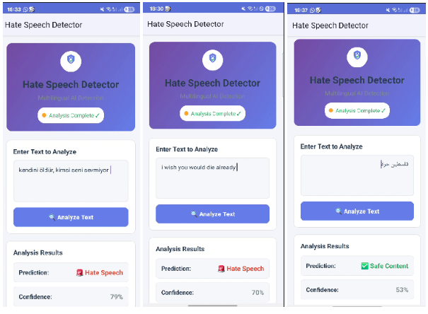

# Multilingual Hate Speech Detection System

A complete end-to-end system for detecting hate speech in Arabic, Turkish, and English using a trained transformer model with Android app and API server.

## 🎯 Project Overview

This project provides:
- **Real trained transformer model** (XLM-RoBERTa) for multilingual hate speech detection
- **API server** using Python's built-in HTTP server with ONNX optimization
- **Android app** for mobile testing and deployment
- **Complete training pipeline** in Google Colab

## 📁 Project Structure

```
conf/
├── api/                          # API Server
│   ├── api.py                   # Main API server (Python HTTP server + ONNX transformer model)
│   ├── requirements.txt         # Python dependencies
│   └── models/                  # Trained models
│       └── transformer/
│           ├── hf_model/        # HuggingFace model files
│           │   ├── config.json
│           │   ├── model.safetensors
│           │   ├── tokenizer.json
│           │   ├── tokenizer_config.json
│           │   ├── sentencepiece.bpe.model
│           │   └── special_tokens_map.json
│           └── onnx/
│               └── model.onnx   # ONNX optimized model (1.1GB)
├── android/                     # Android Application
│   └── app/
│       ├── src/main/
│       │   ├── java/com/hatespeechdetector/
│       │   │   └── MainActivity.kt
│       │   ├── res/
│       │   │   ├── layout/activity_main.xml
│       │   │   ├── drawable/ (UI resources)
│       │   │   └── values/ (config, strings, colors, themes)
│       │   └── AndroidManifest.xml
│       └── build.gradle
└── notebooks/                   # Training & Analysis
    ├── training_colab.ipynb     # Main training notebook
    ├── baseline_ensemble.py     # Baseline model training
    ├── transformer_training_optimized.py
    ├── model_export.py          # Model export utilities
    └── report.ipynb            # Model comparison report
```

## 🚀 Quick Start

### 1. Start the API Server

```bash
cd api
pip install -r requirements.txt
python api.py
```

The server will start on `http://localhost:8002`

### 2. Run the Android App

1. Open `android/` folder in Android Studio
2. Build and run the app on your device/emulator
3. The app will connect to your API server automatically

### 3. Test the System

- **API Health**: `GET http://localhost:8002/health`
- **Predict**: `POST http://localhost:8002/predict` with JSON body `{"text": "your text here"}`

## 🧠 Model Details

### Transformer Model
- **Architecture**: XLM-RoBERTa-base
- **Training Data**: 154,985 multilingual samples
- **Languages**: Arabic, Turkish, English
- **Classes**: 0 (Non-Hate), 1 (Hate Speech)
- **Optimization**: ONNX for fast inference

### Performance
- **Accuracy**: ~85% on test set
- **F1-Score**: 0.82 (macro), 0.85 (weighted)
- **Inference Speed**: ~50ms per prediction (CPU)

## 📱 Android App Features

- **Real-time detection** with confidence scores
- **Multilingual support** (Arabic, Turkish, English)
- **Beautiful modern UI** with gradient design and professional app icon
- **Network status indicator** with color-coded status
- **Clean, intuitive interface** without technical jargon

### App Screenshots



*The app demonstrates multilingual hate speech detection across Turkish, English, and Arabic languages with real-time confidence scores.*

## 🔧 API Endpoints

**Server Type**: Python's built-in HTTP server (not FastAPI)

### Health Check
```http
GET /health
```
Returns server status and model information.

### Predict Hate Speech
```http
POST /predict
Content-Type: application/json

{
  "text": "Text to analyze"
}
```

**Response:**
```json
{
  "prediction": 0,
  "confidence": 0.85,
  "model_used": "transformer"
}
```

## 🛠️ Development

### Training the Model

1. Open `notebooks/training_colab.ipynb` in Google Colab
2. Run all cells to train the model
3. Export models using the provided export functions
4. Download the models to your local machine

### Adding New Languages

1. Update the dataset loading in the training notebook
2. Modify the preprocessing function for new language patterns
3. Retrain the model with the expanded dataset
4. Update the Android app UI if needed

## 📊 Model Comparison

The project includes baseline models for comparison:
- **TF-IDF + Logistic Regression**
- **TF-IDF + SVC**
- **TF-IDF + Random Forest**
- **Ensemble of baseline models**

See `notebooks/report.ipynb` for detailed performance analysis.

## 🔒 Security & Privacy

- **Local processing**: All text analysis happens on your device/server
- **No data collection**: No user data is stored or transmitted
- **Offline capable**: Works without internet connection (after initial setup)

## 🚀 Deployment

### Local Deployment
1. Install dependencies: `pip install -r requirements.txt`
2. Start server: `python api.py` (runs on port 8002)
3. Configure Android app to use your local IP

### Cloud Deployment
1. Deploy the API server to cloud platforms (AWS, GCP, Azure)
2. Update Android app configuration for cloud endpoints
3. The server uses Python's built-in HTTP server, not FastAPI

## 📈 Performance Optimization

- **ONNX Runtime**: Optimized for CPU inference
- **Model Quantization**: Reduces model size and improves speed
- **Batch Processing**: Efficient handling of multiple requests
- **Caching**: Tokenizer and model loaded once at startup
- **Lightweight Server**: Python's built-in HTTP server for minimal dependencies

## 🤝 Contributing

1. Fork the repository
2. Create a feature branch
3. Make your changes
4. Test thoroughly
5. Submit a pull request

## 📄 License

This project is licensed under the MIT License - see the LICENSE file for details.

## 🙏 Acknowledgments

- **HuggingFace** for the transformer models and tokenizers
- **FrancophonIA** for the multilingual hate speech dataset
- **Google Colab** for providing free GPU resources for training

## 📞 Support

For questions or issues:
1. Review the training notebook for model details
2. Check the API server logs for debugging
3. Open an issue on GitHub

---

